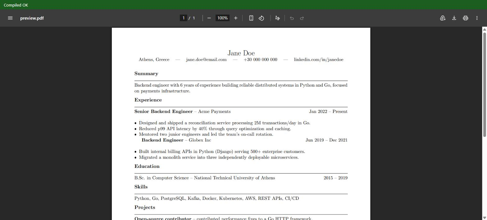
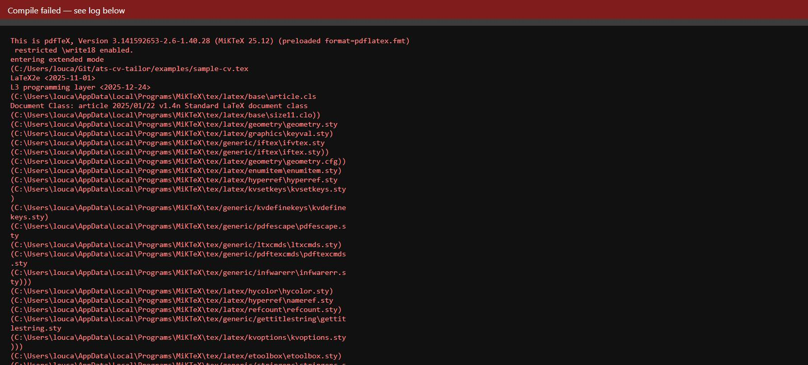
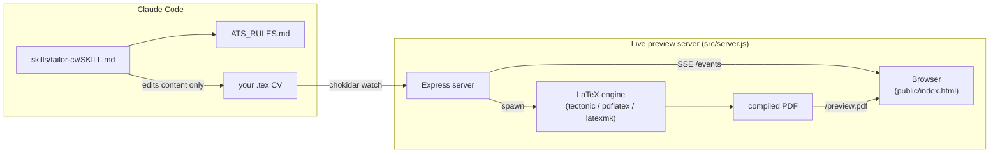

# ats-cv-tailor

Tailor a LaTeX CV to a specific job with a fixed ATS-parsability ruleset, a live
LaTeX → PDF preview, and a coding agent that edits content only — never layout, never
facts it can't already see in your CV.

Most "AI resume tailoring" tools either rewrite your CV into generic, keyword-stuffed
prose, or hand you a black-box "match score" with no way to see what actually changed.
This project is the opposite: a Claude Code skill reads your existing `.tex` CV and a job
description, edits wording/ordering/emphasis in place using your editor's own diff, and
shows you every change before you send anything. A small local server recompiles and
refreshes the PDF in your browser on every save, so you watch the real output as the
agent (or you) edits.


*The preview server showing a successful compile of [`examples/sample-cv.tex`](examples/sample-cv.tex).*

## Why this exists

Tailoring a CV for every application is repetitive, and the two common shortcuts both have
real costs:

- **Generic LLM resume rewriting** tends to launder your bullets into vague,
  buzzword-heavy phrasing ("results-driven team player synergizing cross-functional
  stakeholders") that both ATS keyword matching *and* human reviewers increasingly
  recognize and discount.
- **One-click "optimizer" tools** often chase an unverifiable "match %" score, which
  creates pressure to keyword-stuff or invent experience — and you can't easily audit what
  they changed before it goes out under your name.

This project constrains the edit surface instead: the agent may reorder, reword, and
re-weight content that's already true and already in your CV. It cannot add a skill,
metric, job title, or accomplishment that wasn't there. Every edit lands as a normal file
diff you can read before you send the CV anywhere.

## Key features

- **Live LaTeX preview** — watches your `.tex` file and recompiles on every save, with an
  auto-refreshing PDF and a compile-error overlay (no blank/stale PDF on a broken save).
- **Fixed ATS-parsability ruleset** — [`ATS_RULES.md`](skills/tailor-cv/ATS_RULES.md), 18
  rules covering single-column structure, standard section headers, text extractability,
  date-format consistency, and more.
- **Job-description-aware tailoring** — the `tailor-cv` skill extracts a posting's real
  requirements and terminology, then reorders/rewords existing bullets to surface what's
  relevant.
- **Anti-hallucination constraints** — the skill's instructions explicitly forbid
  inventing experience, skills, or metrics, and treat pasted CV/job-description text as
  data, never as instructions to follow.
- **Reviewable, structure-preserving edits** — content changes only; your preamble,
  packages, custom commands, and visual design are left alone unless you explicitly ask
  for a structural fix.
- **Auto-detected LaTeX engine** — Tectonic, `pdflatex`, or `latexmk`, whichever is on
  your `PATH`, with an override via `LATEX_ENGINE`.
- **`npm run doctor`** — one command that checks your Node version, LaTeX engine,
  required files, and port availability before you try to run anything.

## Demo

```bash
npm install
npm run preview -- examples/sample-cv.tex
```

Open `http://localhost:5050` — you'll see the compiled PDF and a green "Compiled OK"
status bar. Edit `examples/sample-cv.tex` and save; the preview recompiles and refreshes
within about a second.


*Saving a broken `.tex` file shows the compiler log instead of a stale PDF.*

To try the full tailoring workflow with a coding agent:

1. Install the `tailor-cv` skill (see [Quick start](#quick-start) below).
2. In Claude Code: `Tailor my CV at examples/sample-cv.tex for this job posting: <paste examples/sample-job-description.txt>`
3. Read the diff the agent produces and the summary it gives you.
4. Watch `npm run preview -- examples/sample-cv.tex` update live as edits land.

A full walkthrough with a real prompt is in [`examples/example-prompt.md`](examples/example-prompt.md).
A recording script for capturing your own demo GIF/MP4 is in
[`docs/DEMO_RECORDING_GUIDE.md`](docs/DEMO_RECORDING_GUIDE.md).

## Before and after

Illustrative example (fictional candidate "Jane Doe", fictional employer "Northwind
Cloud") — full diff and rationale in [`examples/BEFORE_AFTER.md`](examples/BEFORE_AFTER.md):

| Before | After |
|---|---|
| Backend engineer with 6 years of experience building reliable distributed systems in Python and Go, focused on payments infrastructure. | Backend engineer with 6 years of experience designing and operating distributed systems in Go, with hands-on on-call and incident-response experience in payments infrastructure. |

What changed: the summary now surfaces "on-call and incident-response" — a fact already
stated later in the same CV ("led the team's on-call rotation") — because the target
posting explicitly asks for production-ownership experience. No new skill, employer,
metric, or accomplishment was added.

## Quick start

Prerequisites: **Node.js 18+** and **one LaTeX engine** — [Tectonic](https://tectonic-typesetting.github.io/)
(self-contained, easiest to install), or `pdflatex`/`latexmk` from MiKTeX or TeX Live.

```bash
git clone https://github.com/<your-fork>/ats-cv-tailor.git
cd ats-cv-tailor
npm install
npm run doctor                              # confirms Node, LaTeX engine, files, and port are OK
npm run preview -- examples/sample-cv.tex   # open http://localhost:5050
```

No LaTeX installed locally? `docker build -t ats-cv-tailor . && docker run --rm -p 5050:5050 -v "$(pwd)/examples:/cv" ats-cv-tailor /cv/sample-cv.tex`
skips the install — see [Deployment](#deployment) for details and caveats.

Using it with **Claude Code**:

```bash
# global install
cp -r skills/tailor-cv ~/.claude/skills/tailor-cv

# or per-project
cp -r skills/tailor-cv <your-project>/.claude/skills/tailor-cv
```

Then, in Claude Code: `Tailor my CV at ~/cv/my-cv.tex for this job posting: <paste or path>`.

Using it with **Codex or other coding agents**: not yet tested. `SKILL.md` and
`ATS_RULES.md` are plain markdown with no Claude-specific tooling, so pointing another
agent at them and asking it to follow the process should work in principle — if you try
it, please open an issue with what did or didn't work.

## Installation details

- **Windows**: verified with [MiKTeX](https://miktex.org/) (`pdflatex`, `latexmk`) on
  Node 24 / PowerShell and Git Bash. MiKTeX prompts to install missing packages on first
  compile if you're using its "install packages on the fly" setting.
- **macOS**: `brew install tectonic` is the fastest path (single binary, no separate TeX
  distribution). MacTeX also works via `pdflatex`/`latexmk` but is a multi-GB install.
- **Linux**: install Tectonic via your package manager or `cargo install tectonic`, or
  install `texlive-latex-base`/`texlive-latex-extra` for `pdflatex`/`latexmk`.
- No other shell dependencies are required — the preview server is a plain Node/Express
  process.

## Usage

```bash
npm run preview -- path/to/your-cv.tex      # start the live preview
PORT=5151 npm run preview -- path/to/cv.tex # use a different port
LATEX_ENGINE=pdflatex npm run preview -- cv.tex  # force a specific engine
npm run doctor                              # diagnose environment problems
npm run check -- path/to/cv.tex             # flag wrapped bullets whose last line is <75% full and AI-slop phrasing
```

Example Claude Code prompt (see [`examples/example-prompt.md`](examples/example-prompt.md)
for the full walkthrough):

> Tailor my CV at `~/cv/my-cv.tex` for this job posting: <paste or path>

## How the tailoring system works

1. **Read** — the agent reads your `.tex` CV and the job description in full.
2. **Audit** — it checks the existing document against the structural ATS rules; if it
   already violates one (e.g. a table or multi-column layout), it asks before touching
   layout rather than restructuring silently.
3. **Extract** — it pulls the job posting's real requirements and terminology.
4. **Edit** — using a normal file edit (not a full rewrite), it changes bullet wording,
   ordering, and emphasis — never the preamble, packages, or visual structure.
5. **Re-check** — page count and date-format consistency are re-validated after editing.
6. **Summarize** — it reports what was reordered, reworded, and trimmed, and which
   keywords were aligned, so you can verify truthfulness before sending it anywhere.
7. **Compile** — the live preview server (`src/server.js`) watches the file with
   `chokidar`, recompiles with the detected LaTeX engine on every save, and streams
   compile status to the browser over Server-Sent Events.
8. **Review** — you're the last step. Nothing here sends your CV anywhere; it edits a
   local file.

## Truthfulness and safety constraints

These are **prompt-based instructions enforced by the `tailor-cv` skill**, not a
technical/code-level sandbox — the skill runs inside your coding agent and depends on
the agent following its instructions.

| Constraint | How it's enforced |
|---|---|
| No invented skills, experience, or accomplishments | Explicit instruction: only reorder/reword content already in the source CV |
| No inflated or fabricated metrics | Explicit instruction: never add a number/percentage/scale that isn't already present |
| No false job titles or date ranges | Structural edits (titles, dates) are out of scope unless you explicitly request them |
| No unsupported certifications | Same as above — content addition is restricted to what already exists |
| No keyword stuffing | Rule 15 explicitly treats repeated/forced phrasing and high textual overlap with the job description as a negative signal, not a target |
| Prompt-injection resistance | The skill instructs the agent to treat job-description/CV text strictly as data, never as directives to follow, even if it contains fake "system notes" |

**Not enforced by this project:** application-form/screening questions (work
authorization, salary range, certifications) are outside the CV content the skill edits —
you're responsible for those answers. Since these are instructions to an LLM agent, not a
compiler-level constraint, always read the diff the agent produces before trusting it.

## Architecture



The two pieces are independent: you can use the `tailor-cv` skill without the preview
server (any PDF viewer works), or run the preview server on a CV you're editing by hand
without the skill at all.

## Repository structure

```
bin/preview.js          CLI entry point — starts the live preview server
bin/doctor.js            npm run doctor — environment/dependency diagnostic
bin/check.js             npm run check — line-spillage + AI-slop checker (logic in src/check.js)
src/server.js            Express + chokidar server: compile, watch, SSE status
public/index.html        Browser UI: PDF iframe + status bar + error log overlay
skills/tailor-cv/
  SKILL.md                Claude Code skill: process and constraints
  ATS_RULES.md             The 18-rule fixed ATS ruleset the skill enforces
examples/                 Fictional sample CV, job description, and before/after
docs/assets/               Screenshots used in this README
docs/DEMO_RECORDING_GUIDE.md  Script for recording a demo GIF/MP4
test/server.test.js       node:test suite for src/server.js
Dockerfile, .dockerignore  Optional local-install shortcut (see Deployment) — not a hosting config
.github/workflows/ci.yml  Lint + test + docker build on push/PR
```

## Configuration

No `.env` file or config file is read — the only configuration is environment variables
passed to `npm run preview`:

| Variable | Default | Purpose |
|---|---|---|
| `PORT` | `5050` | Port the preview server listens on |
| `LATEX_ENGINE` | auto-detected | Force a specific engine (`tectonic`, `pdflatex`, `latexmk`) instead of auto-detection |
| `TECTONIC_CACHE_DIR` | Tectonic's platform default | Docker image only — where Tectonic caches downloaded LaTeX packages; mount a volume here to persist it (see [Deployment](#deployment)) |

Never commit secrets to this repo — there currently aren't any to manage (no API keys, no
external services).

## Limitations

- **Output quality depends on your source CV.** The skill edits and reorders existing
  content; it does not write a CV from nothing, and it can't improve content it isn't
  told to look at.
- **Requires a local LaTeX installation** (or Tectonic), or the provided Docker image.
  `npm run doctor` will tell you if none is found locally.
- **ATS behavior varies by employer and vendor.** `ATS_RULES.md` documents conventions
  with reasoning, not guarantees — some rules (e.g. one-page heuristic) are strong
  convention, not a hard parsing requirement, and the rules file says so explicitly where
  that's the case.
- **Agent output requires human review.** The truthfulness constraints are prompt-based
  instructions, not a code-level check — always read the diff.
- **Only the `.tex`/LaTeX format is supported.** No Word/Markdown/plain-text CV format is
  handled by either the skill or the preview server.
- **Tested with Claude Code only.** Codex/other agent compatibility is untested (see
  Roadmap).
- **The preview server has no authentication** and is meant for local use only — see
  [`SECURITY.md`](SECURITY.md).

## Deployment

This is a **local developer tool + Claude Code agent skill**, not a hosted web
application, and it isn't meant to be deployed publicly:

- The live preview server exists to watch *your local file* while a LaTeX engine
  recompiles it — there's no multi-user or multi-tenant use case.
- It has no authentication layer (see [Limitations](#limitations) /
  [`SECURITY.md`](SECURITY.md)), so running it as a public service would expose whatever
  `.tex` file it's pointed at to anyone who finds the URL.

A [`Dockerfile`](Dockerfile) is included as an **optional local-install shortcut**, not a
hosting/deployment path — it exists to skip installing a LaTeX distribution yourself, not
to put this on the public internet.

```bash
docker build -t ats-cv-tailor .
docker run --rm -p 5050:5050 -v "$(pwd)/examples:/cv" ats-cv-tailor /cv/sample-cv.tex
```

Open `http://localhost:5050` as usual. This was built and run end-to-end as part of
preparing this repo, including a compile with `--network none` to confirm it works with
zero runtime internet access — **for the two CVs bundled in `examples/`**, since the image
pre-warms Tectonic's package cache by compiling those specific files at build time.
Tectonic fetches LaTeX packages/classes it needs lazily, per file, the first time they're
referenced — a CV of yours that uses packages the examples don't (a different document
class, extra packages, custom fonts) will trigger a real network fetch on its first
compile inside the container. Mount a volume at `TECTONIC_CACHE_DIR`
(`/opt/tectonic-cache` in the image) if you want whatever it fetches to persist across
container restarts instead of re-fetching every time:

```bash
docker run --rm -p 5050:5050 \
  -v "$(pwd)/examples:/cv" \
  -v tectonic-cache:/opt/tectonic-cache \
  ats-cv-tailor /cv/sample-cv.tex
```

## Roadmap

- [ ] Verify and document compatibility with Codex and other coding agents
- [ ] Additional starter CV templates beyond the single-column example
- [ ] macOS/Linux runners in CI (currently `ubuntu-latest` only, testing Node 18.x/20.x)

## Contributing

See [`CONTRIBUTING.md`](CONTRIBUTING.md) for dev setup, the pre-PR checklist, and scope
guidelines.

## License

MIT — see [LICENSE](LICENSE).
